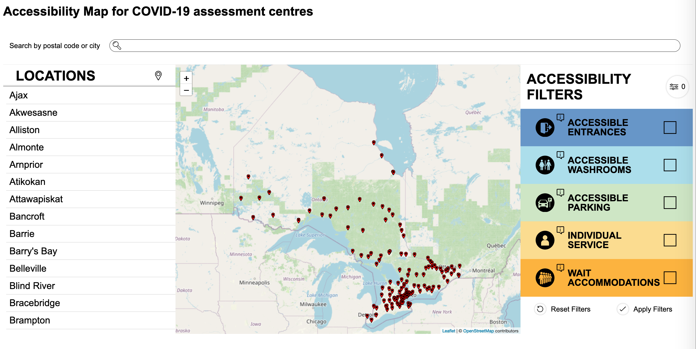
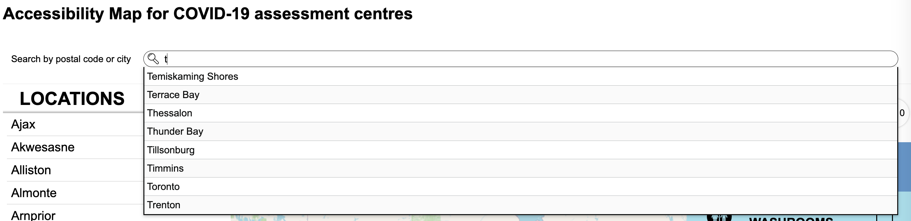
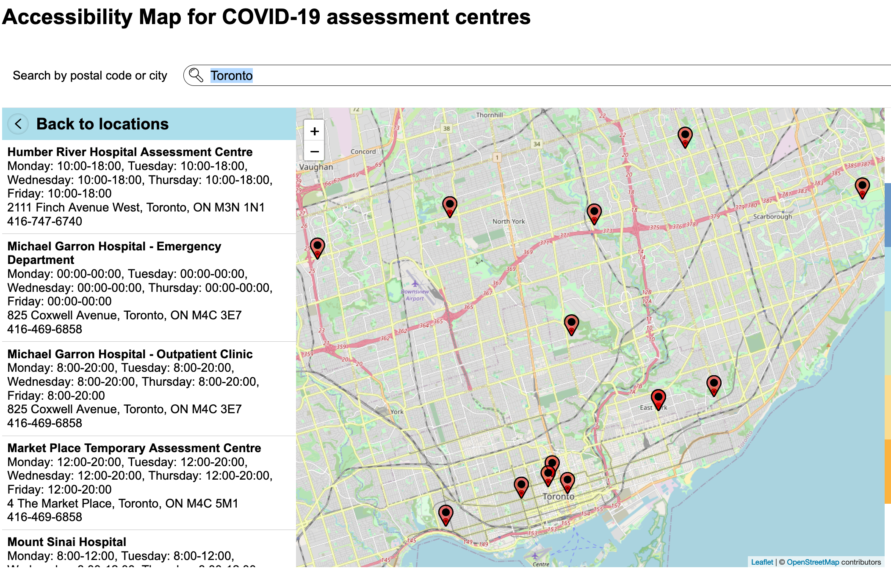
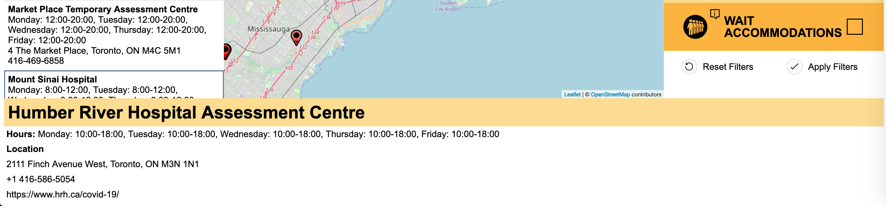

# Desktop View - Manual Test Plan

The desktop view is applied when the browser width is above 1024px, the iPad size.

## Initial load

Load the COVID map. The interface shows the content as the screenshot below:

1. The search input box is empty;
2. Three panels are shown under the search box: the cities list, the map and the accessibility filter panel;
3. The cities list shows all citeis in Ontario that have COVID assessment centres;
4. The map shows an overview of all COVID assessment centres in Ontario;
5. The accessibility filter panel lists all accessibility features to filter COVID assessment centres that provide
these accessibility services. All checkboxes in this panel is unchecked. The number at the top right corner of the
panel shows the total number of selected filters is 0.

## Search functionality

### Search

There are 3 ways to search for a COVID assessment centre:

1. Select a city from the auto-completed search input box;
2. Select a postal code from the auto-completed search input box;
3. Select a city from the cities list.

#### Method 1: Select a city from the auto-completed search input box

1. Use keyboard or mouse to focus in the search input box;
2. Start to type a letter for example "t";
3. A drop down list box shows up with all matching city names starting with "t". See the screenshot below;
4. Select the city you are interested in from the auto-completed drop down list box.

#### Method 2: Select a postal code from the auto-completed search input box

1. Use keyboard or mouse to focus in the search input box;
2. Start to type a letter then a number for example "m9";
3. A drop down list box shows up with all matching postal codes starting with "m9". See below;
4. Select the postal code you are interested in from the auto-completed drop down list box.

#### Method 3: Select a city from the cities list

1. Search a city from the cities list:

### Verify search results page

All 3 methods above will end up as the screenshot below:

1. The cities list is replaced by search results;
2. The map zooms in to the selected city;
3. An "X" button is shown at the right end of the search input box.

### Reset search

1. Click the "X" button at the right end of the search input box;
2. Everything restores to the initial load state: search input box is empty; the "X" button at the right end of the
search box disappears; the cities list is back, the map restores to the overview of Ontario.

## Results page

### Select a COVID assessment centre from the search results page

1. Select a city from the cities list;
2. The results page is shown as the screenshot above;
3. Scroll up and down on the results page, find and select a COVID assessment centre from the search results page;
4. The corresponding hospital description is shown at the bottom of the page. See the screenshot below:

### Back to locations

1. Click "Back to locations" button on the search results page;
2. Everything restores to the initial load state: search input box is empty; the "X" button at the right end of the
search box disappears; the cities list is back, the map restores to the overview of Ontario.

## Accessibility filter panel

### Reset filters

1. Select a number of checkboxes in this panel. While checking, the number at the top right corner of the panel
increases to show the total number of selected filters;
2. Deselect some checkboxes, the number at the top right corner of the panel decreases;
3. Make sure some checkboxes are checked;
4. Click "reset filters" button;
5. All checkboxes are unchecked. the number at the top right corner of the panel restores to 0.

### Apply filters

This feature is currently implemented with respect to [the placeholder data](/data/merged/output.csv).

## Map zoom in & zoom out

Users can zoom the map by clicking on the zoom in/out buttons or use mouse wheel to zoom in/out.
