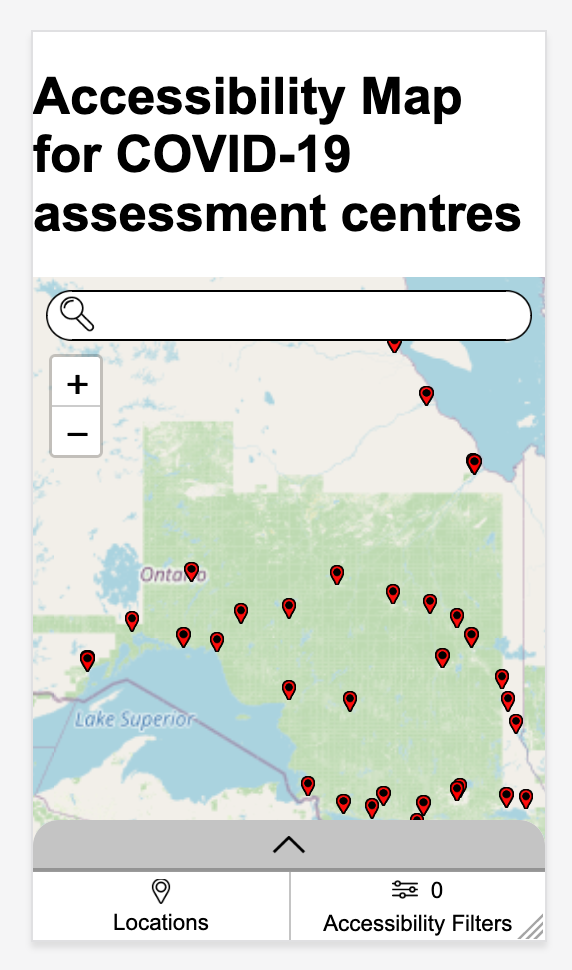
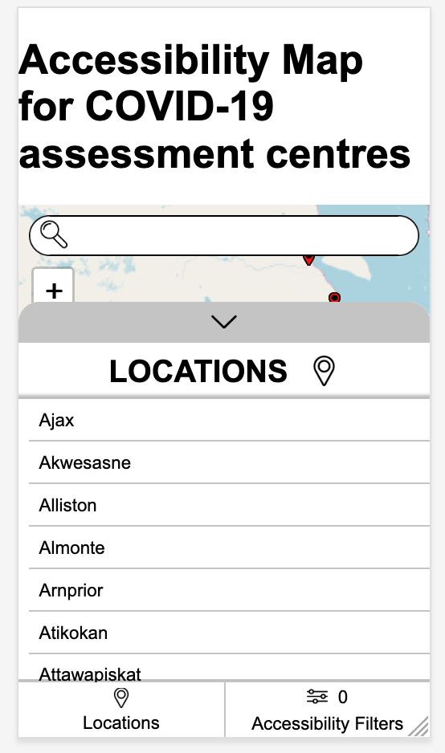

# Mobile View - Manual Test Plan

Mobile view is applied when the browser width is below 1024px, the iPad size. This test plan is based on
[Mobile View - Manual Test Plan](desktopViewTestPlan.md). It doesn't contain common functionalities that
have been described in the desktop view test plan including search auto-complete, search methods, reset search and
reset filters.

## Initial load

Load the COVID map. The interface shows the content as the screenshot below:

1. "Locations" button and "Accessibility Filters" button show at the bottom of the page;
2. Above these buttons, shows a grey bar with an arrow up button. Clicking the arrow up button expands the cities list.

## "Locations" button: Show the cities list

1. Click the "Locations" button at the bottom;
2. The cities list is shown as the screenshot below:

## "Accessibility Filters" button: Show the accessibility filters panel

1. Click the "Accessibility Filters" button at the bottom;
2. The accessibility filters panel is shown as the screenshot below:

3. The number above the words "Accessibility Filters" shows the total number of selected filters.

## Expand and collapse a panel

1. Click the arrow up or the arrow down button on the grey bar;
2. The corresponding panel expands or collapses.

## Panel interaction

1. Click the "Locations" button to bring up the cities list;
2. Select a city from the list;
3. The results page shows up with a list of COVID assessment centres in the selected city;
4. Select an assessment centre from the results page;
5. The hospital description page shows up.

Note:

1. Anytime, there is only one panel is shown while other panels are invisible
2. Anytime, "Back to locations" button will bring the user back to the cities list.
